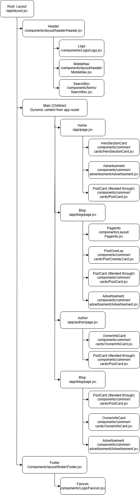

# Next.js Project

This is a Next.js (https://nextjs.org/) project created using create-next-app (https://github.com/vercel/next.js/tree/canary/packages/create-next-app).

## a brief introduction

this is a test to submit the application of TechPundits vacancy.

I had some difficulties due to the lack of time but the design wasn't that complicated:

## Component Tree



## Getting Started

To run this project, follow these steps:

### 1. Clone the project to your machine:

First, clone the repository to your local machine by running the following command in your terminal:

```bash
        git clone https://github.com/anasalabseh/meta-blog-next.git
```

### 2. Navigate to the directory of the cloned repository:

```bash
    cd /path/where/you/cloned/the/repo
```

### 3. Install the necessary dependencies:

```bash
   npm install
```

### 4. Run the development server:

```bash
   npm run dev
```

### Now, open http://localhost:3000 in your browser to see the application in action!

You can start editing the page by modifying app/page.js. The page will automatically update as you make changes.
